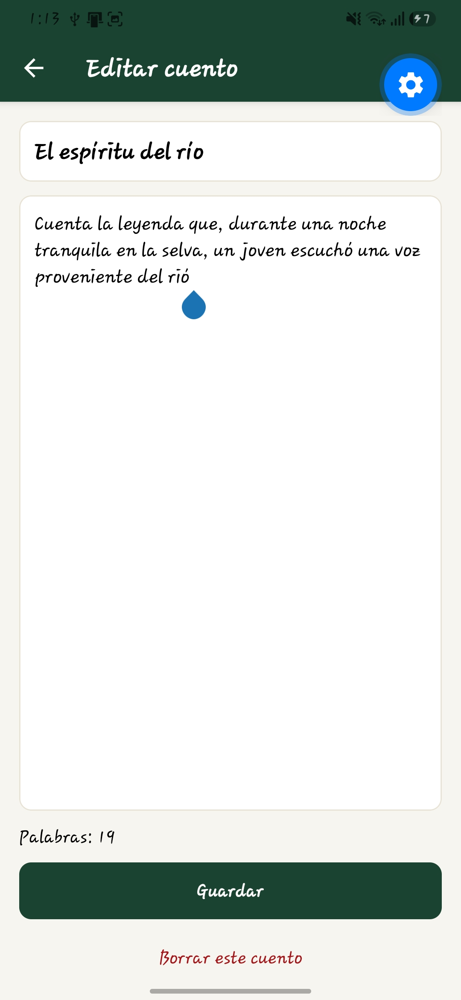
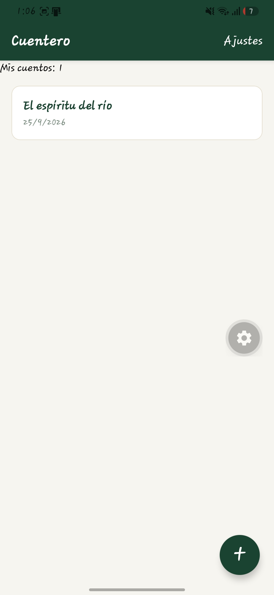
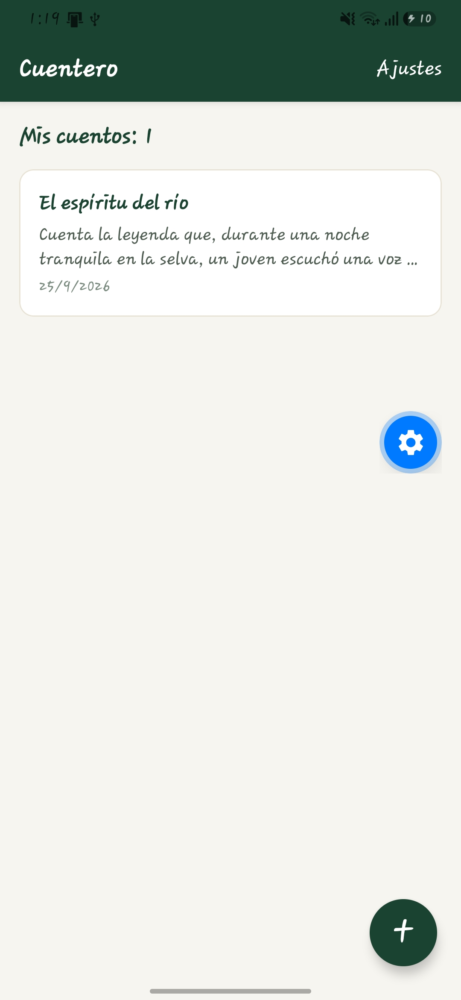
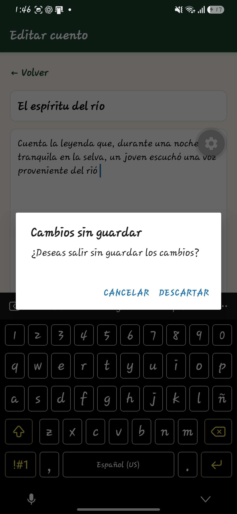
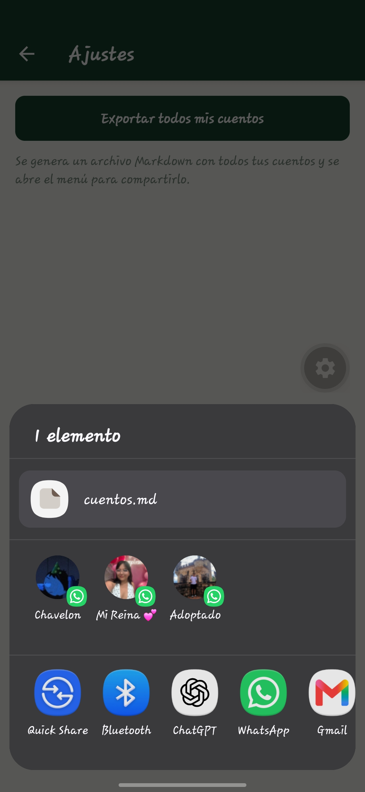
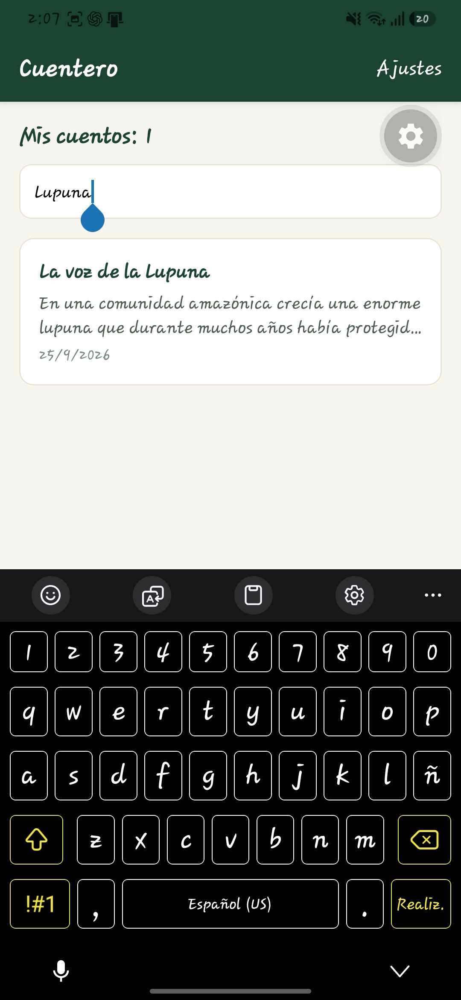
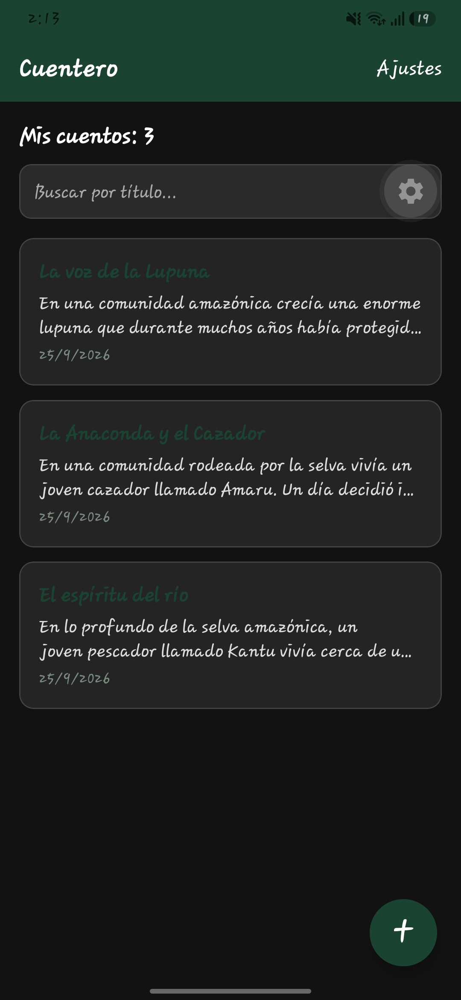

# Cuentero 🌿

Aplicación móvil desarrollada con React Native y Expo para escribir, guardar, editar y borrar cuentos de la selva amazónica.

## 👨‍🎓 Estudiante

**Hans Laulate**

## 📱 Tecnologías utilizadas

- React Native
- Expo
- JavaScript
- Expo Router
- SQLite
- Expo File System
- Expo Sharing

## ✅ Tareas realizadas

### Nivel 1

- [x] T1. Contador de cuentos
- [x] T2. Contador de palabras
- [x] T3. Vista previa del cuento
- [x] T4. Confirmación de cambios sin guardar
- [x] T5. Exportación de cuentos

### Nivel 2

- [x] T6. Búsqueda por título
- [x] T9. Modo oscuro

## 📸 Capturas de pantalla

### T1 — Contador de cuentos

Aquí se muestra la cantidad de cuentos guardados en la aplicación.



### T2 — Contador de palabras

Aquí se muestra el número de palabras del cuento mientras se escribe.



### T3 — Vista previa del cuento

La lista muestra el título y una vista previa del contenido de cada cuento.



### T4 — Cambios sin guardar

La aplicación solicita confirmación cuando se intenta salir de un cuento con cambios sin guardar.



### T5 — Exportación de cuentos

La aplicación permite exportar los cuentos en un archivo Markdown llamado `cuentos.md`.



### T6 — Búsqueda por título

Permite buscar cuentos escribiendo parte de su título.



### T9 — Modo oscuro

La aplicación adapta su apariencia al modo oscuro del dispositivo.



## 📖 Cuentos incluidos

La aplicación contiene tres cuentos:

1. El espíritu del río
2. La anaconda y el cazador
3. La voz de la lupuna

El archivo `cuentos.md` contiene los cuentos exportados desde la aplicación.

## ▶️ Cómo ejecutar el proyecto

### 1. Instalar las dependencias

```bash
npm install